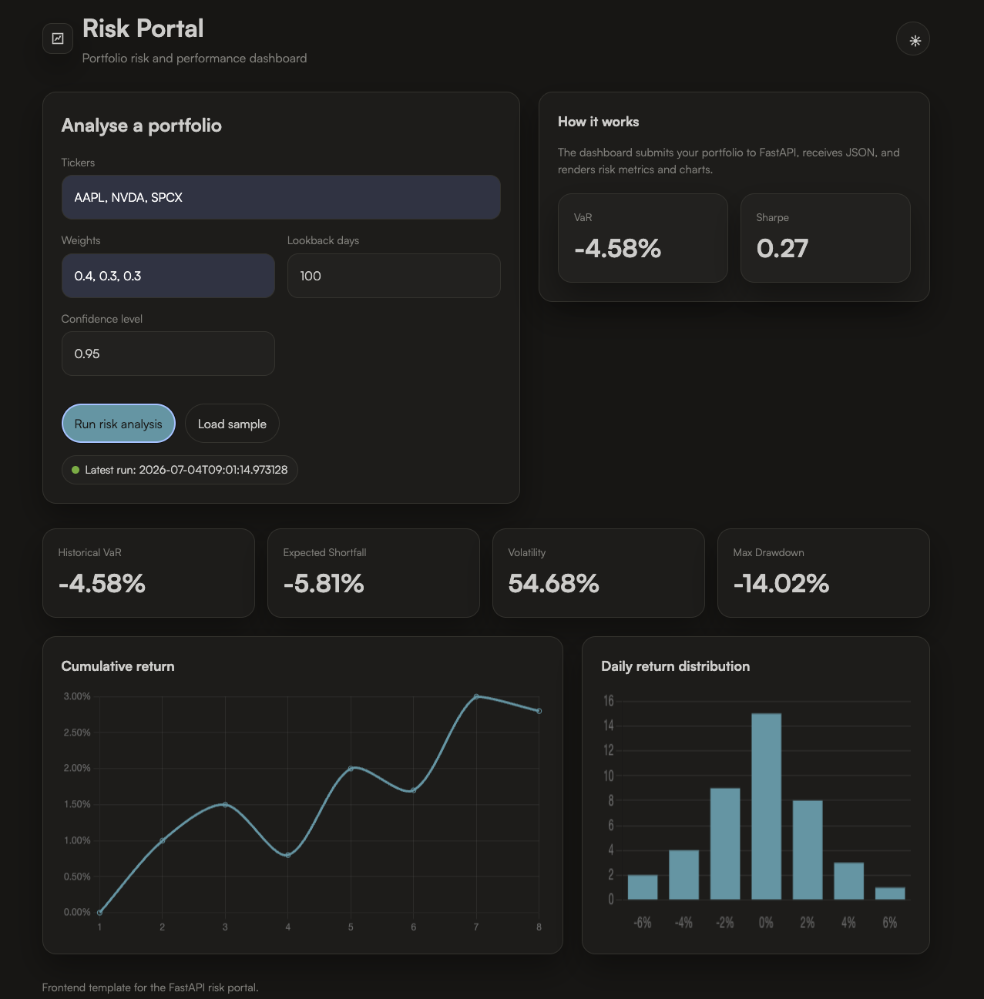

# Risk Portal

A FastAPI-based portfolio risk dashboard that fetches market data with `yfinance`, calculates core risk metrics, stores analyses in SQLite, and renders results in a browser dashboard.

## Features

- Portfolio validation with Pydantic.
- Market data retrieval with `yfinance`.
- Risk metrics including Historical VaR, Variance-Covariance VaR, Monte Carlo VaR, Expected Shortfall, Sharpe Ratio, Max Drawdown, and annualised volatility.
- SQLite history tracking for past portfolio analyses.
- Browser dashboard with Chart.js visualisations.
- Pytest coverage for endpoint response shape.

## Project Structure

```text
risk-portal/
├── main.py
├── routers/
│   └── risk.py
├── models/
│   └── schemas.py
├── services/
│   ├── data.py
│   └── metrics.py
├── database/
│   ├── db.py
│   └── models.py
├── tests/
│   └── test_risk.py
└── risk-dashboard.html
```

## Requirements

- Python 3.10 or later
- `fastapi`
- `uvicorn`
- `yfinance`
- `pandas`
- `numpy`
- `scipy`
- `sqlalchemy`
- `pytest`
- `httpx`

## Setup

Create and activate a virtual environment:

```bash
python3 -m venv .venv
source .venv/bin/activate
```

Install dependencies:

```bash
pip install fastapi uvicorn yfinance pandas numpy scipy sqlalchemy pytest httpx
```

If a `requirements.txt` file exists, install from it instead:

```bash
pip install -r requirements.txt
```

## Run the API

Start the FastAPI app from the project root:

```bash
uvicorn main:app --reload
```

Open the interactive docs in your browser:

- http://127.0.0.1:8000/docs

## Run the Dashboard

Open `risk-dashboard.html` in a browser while the API is running at `http://127.0.0.1:8000`.

If the browser blocks local file requests, serve the file with a simple static server:

```bash
python -m http.server 5500
```

Then open:

- http://127.0.0.1:5500/risk-dashboard.html

## Example Request

`POST /risk/analyse`

```json
{
  "tickers": ["0700.HK", "9988.HK", "3690.HK"],
  "weights": [0.4, 0.3, 0.3],
  "lookback_days": 365,
  "confidence_level": 0.95
}
```

### Input Notes

- Tickers must be sent as an array of strings.
- Weights must be sent as an array of numbers.
- The number of tickers must match the number of weights.
- Hong Kong tickers should use the `.HK` suffix.

## Example Response Shape

```json
{
  "portfolio": {
    "tickers": ["0700.HK", "9988.HK", "3690.HK"],
    "weights": [0.4, 0.3, 0.3]
  },
  "period": {
    "start_date": "2025-07-04",
    "end_date": "2026-07-04",
    "trading_days": 252
  },
  "risk_metrics": {
    "var_historical": -0.025,
    "var_variance_covariance": -0.024,
    "var_monte_carlo": -0.026,
    "expected_shortfall": -0.031,
    "sharpe_ratio": 0.84,
    "max_drawdown": -0.12,
    "annualised_volatility": 0.18
  },
  "chart_data": {
    "labels": [],
    "daily_returns": [],
    "cumulative_returns": []
  },
  "computed_at": "2026-07-04T08:25:59.475615"
}
```

## Run Tests

Run the full test suite:

```bash
python -m pytest -q
```

Run one test only:

```bash
python -m pytest tests/test_risk.py::test_risk_analyse_response_shape -q
```

## Common Issues

### 422 Unprocessable Entity

This usually means the request body does not match the Pydantic schema.

Check that:

- `tickers` is a JSON array, not a comma-separated string.
- `weights` is a JSON array of numbers.
- The arrays have the same length.
- The ticker strings do not include extra quotes.

Correct:

```json
{
  "tickers": ["0700.HK", "9988.HK"],
  "weights": [0.6, 0.4],
  "lookback_days": 365,
  "confidence_level": 0.95
}
```

Incorrect:

```json
{
  "tickers": "\"0700.HK\", \"9988.HK\"",
  "weights": "0.6, 0.4"
}
```

## Dashboard Preview
